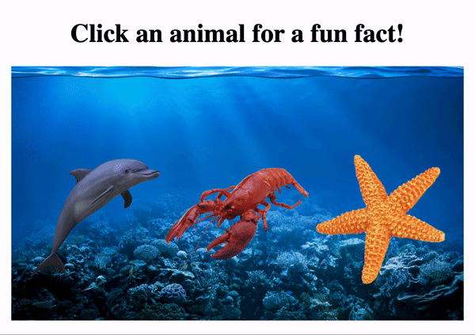

link to lesson:

https://www.codecademy.com/courses/react-101/projects/js-react-animal-fun-facts

### LEARN REACT

# Animal Fun Facts

In this project, we’ll build a program that allows users to click an animal on the screen in order to have a fun fact pop up.

Our program will display a selection of animals on the screen. We’ll be allowed to decide if we want to include a background or not. Clicking an animal will cause a fact to be randomly selected from a list of potential options. The selected fact will pop up on the screen. As we keep clicking, we’ll be able to see different facts.

If you get stuck during this project or would like to see an experienced developer work through it, click “Get Unstuck“ to see a project walkthrough video.

Let’s get started!
